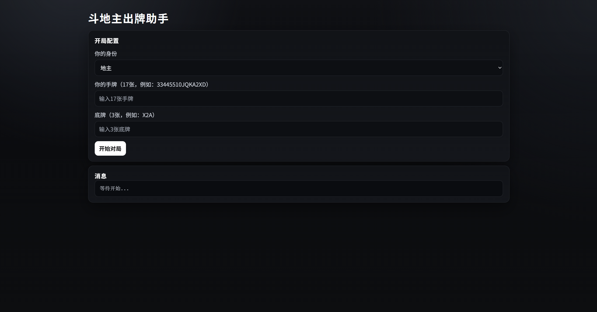
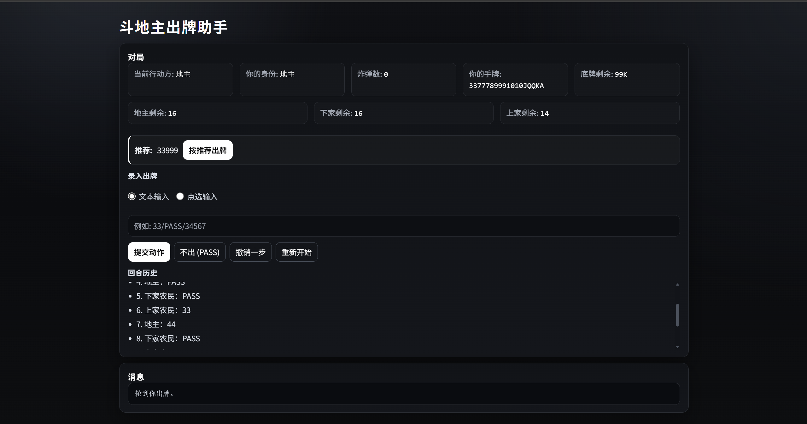

# 斗地主助手 / DouDiZhu Assistant

<strong>简短介绍(简体中文)</strong>

一个简洁的斗地主辅助项目，帮助你在对局中更快做出更稳妥的出牌判断。

模型采用 DouZero。  

Windows 双击 `start.bat` 启动。  
Linux通过 `start.sh` 启动。

- 开局填写身份、手牌和底牌，进入对局辅助。
- 每轮会根据开局配置与出牌历史给出建议出牌作为参考。

<strong>Brief Intro (English)</strong>

A lightweight DouDiZhu assistant project that helps you make faster and more reliable play decisions during matches.  

Powered by DouZero.  

On Windows, launch it by `start.bat`.  
On Linux, launch it by `start.sh`.

- At the start, enter your role, hand cards, and landlord cards to begin the assistant.
- Each turn, it provides a recommended move based on your setup and action history for reference.

